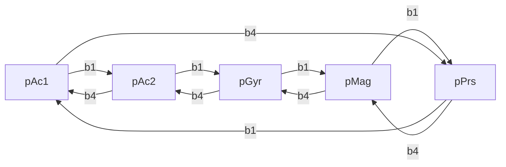
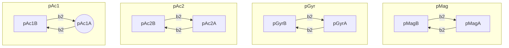

# Progetto d'esame E3101Q124

### Sessione Luglio 2020

<p style="text-align:center">
    Jacopo Maltagliati - 830110</br>(<a>j.maltagliati@campus.unimib.it</a>)
</p>


## Sommario

Il progetto qui presentato consiste nella stesura di un programma conforme alle specifiche fornite nel file `progetto.v15jun20.pdf`. Ho scelto di implementare il programma avvalendomi delle funzionalità fornite dal componente FreeRTOS, al fine di fare affidamento su componenti che credevo ben sviluppati e testati in situazioni reali. La mia sorpresa nel vedere che allo scheduler mancano alcune funzionalità importanti (ad esempio non sembra possibile garantire una deadline, se non interrompendo bruscamente il task) e che gli sviluppatori del software CubeMX non hanno avuto troppa cura delle conseguenze delle loro azioni è stata grande, ma identificare e aggirare questi problemi è stata sicuramente un'esperienza istruttiva. Trovo inoltre che la periferica LCD si sia rivelata problematica: è molto sensibile a trasferimenti bidirezionali bruschi e dopo un po' di tempo (tra i 5 e i 20 minuti circa) tende a non ricevere più i dati dalla scheda.

## Configurazione della scheda

Per la configurazione della scheda è stato creato un nuovo progetto, il quale è stato configurato con lo strumento STM32CubeMX come segue:

- E' stato abilitato il componente FreeRTOS (`Middleware > FREERTOS`) ed impostato il Timebase su `TIM1` (`System Core > SYS > Timebase Source`);
- I pin `I2C_SCL` e `I2C_SDA` sono stati spostati da `PB6-PB7` a `PB8-PB9`;
- Il clock è stato impostato a $100\text{ MHz}$;
- E' stata impostata, per rendere più semplice la stesura del codice, la flag `Project Manager > Code Generator > Generate peripheral initialization as a pair of  '.c/.h' files per peripheral`.

## Componenti del progetto

Segue una breve mappa delle componenti del progetto:

- Headers (`./Core/Inc`)
  - `lcd.h                       ` - Driver per l'LCD
  - `lps22hb_reg.h               ` - Driver per il sensore LPS22HB
  - `lsm303agr_reg.h              `- Driver per il sensore LSM303AGR
  - `lsm6dsl_reg.h               ` - Driver per il sensore LSM6DSL
  - `u_lcd_helper.h              ` - Interfaccia per il driver dell'LCD
  - `u_list.h                    ` - Lista FIFO
  - `u_lps22hb_driver.h` - Interfaccia per il driver dell'LPS22HB
  - `u_lsm303agr_driver.h` -  Interfaccia per il driver dell'LSM303AGR
  - `u_lsm6dsl_driver.h          ` -  Interfaccia per il driver dell'LSM6DSL 
  - `u_root.h` - Variabili globali condivise, evita dipendenze cicliche
  - `u_timings.h`  - Temporizzazione dei task
  - `u_types.h                   ` - Tipi custom

Sono state escluse le componenti generate da STM32CubeMX, le cui modifiche saranno esplicitate più avanti.

## Descrizione delle Componenti

#### `lps22hb_reg.[c,h]`, `lsm303agr_reg.[c,h]` e `lsm6dsl_reg.[c,h]`

Questi file compongono i driver delle periferiche MEMS presenti sulla daughterboard X-NUCLEO-IKS01A2, che sono stati integrati dal progetto `test-sensori` visto in laboratorio.

#### `lcd.[c,h]` 

Questi file compongono il driver della periferica LCD, che è stato integrato dal progetto `test-sensori` visto in laboratorio. L'unica modifica che è stata effettuata è alla seguente funzione:

```c
uint8_t lcdReadButtons() {
	uint8_t data = GET_BUT;
	uint8_t buttons = 0xF; // override lettura fallita
	HAL_I2C_Master_Transmit(_hi2c, ADDRESS << 1, &data, 1, 1000);
	HAL_Delay(10); // molto più stabile
	HAL_I2C_Master_Receive(_hi2c, ADDRESS << 1, &buttons, 1, 1000);
	return buttons;
}
```

La variabile `buttons` ora contiene il valore `0xF` di default, il che significa che non viene registrato nessun input nel caso la fuzione `HAL_I2C_Master_Receive()` fallisca. Inoltre è stato introdotto un delay di 10 tick per dare il tempo al bus I2C di terminare i trasferimenti in corso, soluzione che ne migliora ampiamente la stabilità.

#### `u_lcd_helper.[c,h]` 

Questi file compongono l'interfaccia che la logica di controllo usa per accedere alla periferica LCD, ai bottoni e alla macchina a stati finiti che gestisce la stampa a schermo. Segue una breve descrizione dell'interfaccia:

##### Definizioni per le maschere del registro dei bottoni

```c
#define D_BUTTON1_MASK 0x01
#define D_BUTTON2_MASK 0x02
#define D_BUTTON3_MASK 0x04
#define D_BUTTON4_MASK 0x08
```

Per leggere la pressione di un bottone, il driver fornisce in una variabile un numero intero senza segno a 8 bit che rappresenta il valore del registro periferica del bottone. I quattro bit meno significativi del registro rappresentano lo stato dei quattro bottoni, nello specifico (rappresentazione big-endian):

| Bit 4     | Bit 5     | Bit 6     | Bit 7     |
| --------- | --------- | --------- | --------- |
| Bottone 4 | Bottone 3 | Bottone 2 | Bottone 1 |

Nel caso il bit sia `1`, il bottone non è stato premuto, in caso contrario sì.

Mascherando questo registro con le configurazioni di bit `0001`, `0010`, `0100`, e `1000` è quindi possibile ottenere il valore dei singoli bottoni. 

##### Definizioni per le righe del display LCD

```c
#define H_LCD_ROW_TOP 0
#define H_LCD_ROW_BTM 1

typedef enum {
	top = 0,
	bottom
} row_t;
```

Il display LCD ha una capacità di 32 caratteri disposti su due righe da 16 ciascuna. La funzione `lcdSetCursor()` del driver prevede che siano specificate le coordinate per le righe e le colonne: queste due definizioni rappresentano le prime. L'enumerazione viene usata per effettuare un controllo interno sui limiti dei valori inseriti.

##### Definizioni per la trasmissione dei dati allo schermo LCD

```c
#define H_LCD_TX_BUF_DIM 64 // Dimensione del buffer dell'LCD
#define H_LCD_TX_GRACE 50 // [ms] Delay di trasmissione
UART_HandleTypeDef huart3; // Porta UART per l'LCD
uint8_t lcd_tx_buffer[H_LCD_TX_BUF_DIM]; // Buffer di trasmissione per l'LCD
```

In maniera del tutto simile al programma `test-sensori`, la trasmissione al display LCD avviene scrivendo con `sprintf()` su un buffer e, successivamente, inviandolo allo schermo. Queste definizioni rispettivamente forniscono il valore della dimensione del buffer di trasmissione e del tempo da lasciare al bus I2C per terminare i trasferimenti in corso.

La variabile `huart3` definisce la porta UART usata per il trasferimento dei dati verso la scheda del display LCD e `lcd_tx_buffer` è il suddetto buffer di trasmissione.

##### Variabili globali per la FSM

```c
typedef struct state_t state_t;

// Stato FSM
struct state_t {
	state_t* transitions[4]; // B1, next; B2, page; B3, null; B4, prev;
};

state_t* fsm_state_buffer[2]; // Buffer per l'aggiornamento degli stati
state_t pAc1A, pAc1B, pAc2A, pAc2B, pGyrA, pGyrB, pMagA, pMagB, pPrs; // Stati della FSM
```

Il flusso di controllo impiega una macchina a stati finiti (FSM) per stabilire quali dati è necessario stampare sul display. L'array `fsm_state_buffer[]` contiene due buffer che stabiliscono lo stato corrente della FSM: quando viene premuto un bottone, il nuovo stato viene scritto nel backbuffer (`1`). Durante il prossimo ciclo di stampa, nel caso in cui lo stato sia stato modificato, il frontbuffer (`0`) viene aggiornato.

La struttura `state_t` definisce un tipo di dato contenente a sua volta un array di quattro `state_t`: ogni cella di questo array è un puntatore allo stato in cui la FSM si trova nel caso in cui il bottone corrispondente venga premuto.

##### Funzioni

```c
static inline void H_LCD_Perform_Tx(row_t row) {
	HAL_UART_Transmit(&huart3, lcd_tx_buffer, strlen((char const*) lcd_tx_buffer), 1000);
	HAL_Delay(H_LCD_TX_GRACE);
	lcdSetCursor(0, row);
	lcdPrint((char const*) lcd_tx_buffer);
}

void H_LCD_Round_Error(const float mean, int *round, int *error);
void H_LCD_Print(char const* text, const int num_a, const int num_b, row_t row);
void H_LCD_Blank(row_t row);

void H_LCD_Button_InitFSM();
void H_LCD_Button_StepFSM(uint8_t but);
```

Queste funzioni compongono l'interfaccia utilizzata per comunicare con il display LCD (salvo eccezioni). Segue una breve descrizione:

- `H_LCD_Perform_Tx(row_t)` si occupa di scrivere i dati presenti nel buffer di trasmissione alla riga indicata;
- `H_LCD_Round_Error(const float, int*, int*)` separa un numero in virgola mobile nelle sue parti intera e decimale, è un workaround per [il bug da me descritto sul forum del corso](https://elearning.unimib.it/mod/forum/discuss.php?d=127605);
- `H_LCD_Print(char const*, const int, const int, row_t)` si occupa di formattare i dati passati (`_tttt:xxxxx.yy_`) e scriverli sullo schermo nella posizione indicata;
- `H_LCD_Blank(row_t)` pulisce la riga indicata;
- `H_LCD_Button_InitFSM()` inizializza gli stati della FSM, preparando la mappa delle transizioni;
- `H_LCD_Button_StepFSM(uint8_t)` aggiorna il backbuffer della FSM.

Nonostante l'approccio utilizzato con la combinazione `sprintf()` con solo `%d` e `H_LCD_Round_Error() funzioni, la formattazione perde parecchio in quanto a flessibilità.

#### `u_list.[c,h]`

Questi file implementano una lista FIFO singolo-linkata di dimensione data come segue:

##### Tipi

```c
typedef struct lnode_t lnode_t;
typedef struct list_t list_t;

// Nodo della lista
struct lnode_t {
    float content;
    lnode_t *next;
};

// Lista
typedef struct list_t {
    unsigned int maxsize;
    lnode_t *first;
    lnode_t *last;
    unsigned int size;
    float mean;
} list_t;
```

La struttura `lnode_t` rappresenta semplicemente un nodo della lista, con contenuto di tipo `float` e un puntatore al nodo successivo. 

La struttura `list_t`, invece, prevede una dimensione massima raggiungibile (`maxsize`), una dimensione corrente (`size`), un puntatore in testa per l'inserimento (`first`) e in coda per la rimozione (`last`) e un valore che rappresenta la media (`mean`).

##### Funzioni

La lista è gestita tramite la seguente interfaccia:

```c
list_t* L_New(unsigned int maxsize);
void L_Insert(list_t* list, float content);
void L_UpdateMean(list_t* list);
```

- `L_New(unisgned int)` crea una lista con dimensione massima data ed imposta tutti gli altri campi a valori nulli;
- `L_Insert(list_t*, float)` crea un nodo di valore dato e lo inserisce nella lista specificata. Nel caso in cui il valore di dimensione massima sia superato, il nodo in coda viene eliminato per far posto al nuovo valore. L'inserimento avviene in $O(1)$;
- `L_UpdateMean(list_t*)` aggiorna la media della lista specificata. E' necessario scorrere l'intera lista, per cui il calcolo avviene in $O(n)$.

La funzione `L_Insert()` sfrutta le funzionalità dell'API di FreeRTOS fornite dal file `heap_4.c` per la gestione della memoria (`pvPortMalloc()` e `vPortFree()`), evitando così problemi di concorrenza.

#### `u_lps22hb_driver.[c,h]`

Questi file compongono l'interfaccia che la logica di controllo usa per accedere al sensore LPS22HB. Segue una breve descrizione dell'interfaccia:

##### Definizioni e Variabili

```c
#define LPS22HB_LIST_SIZE 40 // Dimensione lista dati

stmdev_ctx_t lps22hb_dev_ctx; // Registro controllo periferica
lps22hb_data_t lps22hb_data; // Buffer dati
list_t *lps22hb_hPa_list; // Lista dati e media (da stampare)
```

La definizione `LPS22HB_LIST_SIZE` definisce la dimensione massima della lista associata alla periferica, la variabile `lps22hb_dev_ctx` fornisce un interfaccia verso il registro controllo periferica, la variabile `lps22hb_data` fornisce un buffer per i dati raw e il puntatore `lps22hb_hPa_list` permette l'accesso al buffer circolare per i dati su cui calcolare la media.

##### Funzioni

```c
int32_t lps22hb_platform_write(void *handle, uint8_t reg, uint8_t *bufp,
		uint16_t len);
int32_t lps22hb_platform_read(void *handle, uint8_t reg, uint8_t *bufp,
		uint16_t len);

void D_LPS22HB_Init();
void D_LPS22HB_Read();
```

Le funzioni  `lps22hb_platform_*` sono parte dell'interfaccia del driver implementata nel progetto `test-sensori` e permettono l'accesso ai registri periferica del sensore LPS22HB. La funzione `D_LPS22HB_Init()` incapsula l'inizializzazione della periferica presentata nel progetto `test-sensori` e la funzione `D_LPS22HB_Read()` si preoccupa di riempire il buffer con i dati raw provenienti dalla periferica.

#### `u_lsm303agr_driver.[c,h]` e `u_lsm6dsl_driver.[c,h]`

Questi file compongono l'interfaccia che la logica di controllo usa per accedere ai sensori LSM303AGR e LSM6DSL. Essi sono strutturati esattamente come l'interfaccia per il sensore LPS22HB: per approfondire si rimanda quindi alla lettura dei suddetti.

#### `u_root.h`

Questo header permette l'accesso ad una singola variabile (`I2C_HandleTypeDef hi2c1`) condivisa da tutte le periferiche che utilizzano il bus I2C e dai task dell'RTOS.

#### `u_timings.h`

Questo header fornisce unicamente le definizioni necessarie alla temporizzazione dei task, e sarà trattato nel dettaglio nella sezione **I Task**.

#### `u_type.h`

Questo header fornisce alcuni semplici tipi di dato custom utilizzati dai sensori, alcuni dei quali adattati da `test-sensori`. Si rimanda alla lettura del file stesso per chiarimenti.

## La logica di controllo

Come detto in precedenza, il programma fa un uso esteso delle funzionalità del middleware FreeRTOS fornito dal configuratore STM32CubeMX per la gestione della logica di controllo. Segue una descrizione esaustiva delle componenti principali del programma.

#### Inizializzazione

L'inizializzazione della scheda, delle periferiche e del middleware è effettuata dalla funzione `main()`, stesa principalmente da STM32CubeMX durante la configurazione del progetto. Dopo l'inizializzazione delle periferiche conosciute da CubeMX:

```c
/* USER CODE BEGIN 2 */
lcdInit(&hi2c1);

H_LCD_Button_InitFSM();

D_LSM303AGR_Init();
D_LSM6DSL_Init();
D_LPS22HB_Init();
/* USER CODE END 2 */
```

- viene lanciata la funzione `lcdInit()`, fornita da `lcd.h`, sull'handle del bus I2C, al fine di permettere l'inizializzazione dello schermo LCD;
- la funzione `H_LCD_Button_InitFSM()` costruisce la FSM in memoria ed inizializza il buffer stati (`fsm_state_buffer[]`) facendo puntare sia il front- che il backbuffer ad *Accelerometro 1 Pagina 1* (`pAc1A`);

- le funzioni `D_*_Init()` inizializzano le altre periferiche presenti sul bus I2C.

Completata questa sezione di codice, il `main()` inizializza FreeRTOS e fa partire lo scheduler: il flusso del programma, d'ora in avanti, è gestito da esso.

##### I Task

I task risiedono nel file `freertos.c` e sono i seguenti:

| Entry                  | Priorità      |   Frequenza    | Ruolo                                                        |
| ---------------------- | ------------- | :------------: | ------------------------------------------------------------ |
| `T_Reserved()`         | `Realtime7`   |  $\text{N/A}$  | Prepara l'LCD e stampa `FreeRTOS * GO!`                      |
| `M_CalcAll()`          | `AboveNormal` | $10\text{ Hz}$ | Calcola le medie mobili di tutte le liste                    |
| `LCD_Display()`        | `Realtime`    | $1\text{ Hz}$  | Stampa le medie in base allo stato corrente della FSM        |
| `LCD_Button_Readall()` | `Realtime1`   | $20\text{ Hz}$ | Legge lo stato dei bottoni e aggiorna il backbuffer della FSM |
| `XL_GetData()`         | `Normal1`     | $40\text{ Hz}$ | Acquisisce l'accelerazione lineare dal sensore LSM303AGR     |
| `MG_GetData()`         | `Normal2`     | $4\text{ Hz}$  | Acquisisce il flusso del campo magnetico dal sensore LSM6DSL |
| `P_GetData()`          | `Normal3`     | $76\text{ Hz}$ | Acquisisce la pressione barometrica dal sensore LPS22HB      |
| `XL2_GetData()`        | `Normal4`     | $41\text{ Hz}$ | Acquisisce l'accelerazione lineare dal sensore LSM6DSL       |
| `G_GetData()`          | `Normal5`     | $43\text{ Hz}$ | Acquisisce l'accelerazione angolare dal sensore LSM6DSL      |

Si noti che FreeRTOS fornisce le seguenti classi di priorità, in ordine crescente: `Low`, `BelowNormal`, `Normal`, `AboveNormal`, `High`, `Realtime`, ognuna delle quali è a sua volta divisa in dieci sottoclassi (ad es. `Low, Low1, ..., Low9`). Sono quindi disponibili un massimo di 60 classi.

Le frequenze dei task sono definite (in tick) nel file `u_timings.h`, e la conversione in Hertz è effettuata con la seguente formula:
$$
\frac{R[\frac{\text{tick}}{\text{s}}]}{t_i[\text{tick}]}=f_i[\text{Hz}]
$$
Dove $t_i$ è il periodo del task $i$-esimo in tick e $R$ è pari al valore `TICK_RATE_HZ` definito nella pagina di configurazione di FreeRTOS fornita da CubeMX.

Si noti inoltre che:

- Il task `T_Reserved()` è l'unico task non periodico presente nel sistema. 

- Con la risoluzione attuale non è possibile ottenere una frequenza di $75\text{ Hz}$, quindi il periodo per il task che acquisisce i dati del barometro è stato arrotondato a $\frac{1000}{13}=76\text{ Hz}$
- Ho scelto come valore di frequenza per i task di acquisizione dai sensori $x=40\text{ Hz}$: ciò permette alla scheda e a FreeRTOS di lavorare discretamente. Purtroppo, tuttavia, non è stato possibile ottenere una configurazione stabile nel caso in cui più di due task avessero lo stesso periodo: per questo motivo ho deciso di sfalsare leggermente i tick dei task, facendo purtroppo slittare leggermente la frequenza.

##### La FSM

La macchina a stati finiti per il controllo della stampa su display è relativamente semplice, e la relazione tra gli stati è riassunta dal seguente diagramma:





Dove $b_i\ |\ i\in\{1,\dots,4\}$ sono i bottoni, e `pAc1A` lo stato iniziale.

La FSM è gestita dalle funzioni `H_LCD_Button_InitFSM()` e `H_LCD_Button_StepFsm()` e dal task `LCD_Button_Readall()`. Il task `LCD_Display()` inoltre ha accesso sia in lettura che in scrittura, in quanto ad ogni ciclo controlla e aggiorna il frontbuffer.